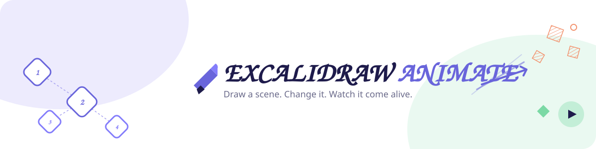
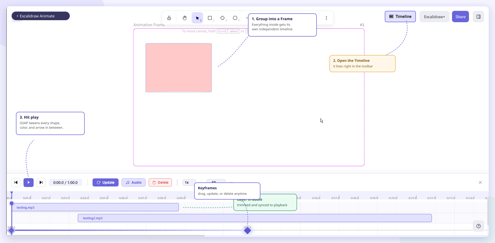

<div align="center">
  <a href="#-demo">
    
  </a>
</div>

<div align="center">

# Excalidraw Animate

**Turn your hand-drawn Excalidraw scenes into smooth, playable animations — free and open source.**

_A layer built on top of [Excalidraw](https://github.com/excalidraw/excalidraw), the open-source virtual whiteboard._

[](./LICENSE)
[](https://github.com/excalidraw/excalidraw)
[](https://gsap.com/)

</div>

<br/>

## 🎬 Demo

<!--
  Drop the demo video/GIF here once it's recorded. A short screen capture
  showing: draw a scene → add a keyframe → change the scene → add another
  keyframe → hit play, is the single most convincing thing in this README.
-->

> 📺 **[Watch the demo video](#)** — draw two scenes, mark them as keyframes, hit play, watch it animate.

<div align="center">
  <!--  -->
</div>

<br/>

## What is this?

**Excalidraw Animate** takes the hand-drawn whiteboard you already know from Excalidraw and adds a **timeline** to it. Draw a scene, capture it as a keyframe, change the scene (move things, resize them, recolor them, redraw an arrow), capture another keyframe — and play it back. Everything in between gets smoothly interpolated for you: positions, sizes, colors, opacity, and even arrow/line shapes actually re-bend and re-stretch instead of just sliding around.


<div align="center">
  
  <p><em>Draw scenes, mark them as keyframes, and the timeline at the bottom interpolates everything in between.</em></p>
</div>

## ✨ Features

- 🖼️ **Animation Frames** — group elements into a frame that gets its own independent timeline.
- 🎞️ **Keyframe Timeline** — scrub, add, update, drag, and delete keyframes on a per-frame timeline with adjustable duration and zoom.
- 🌀 **Real shape interpolation, not just position tweening** — powered by [GSAP](https://gsap.com/). Shapes move, resize, and recolor smoothly between keyframes, and **arrows/lines actually change shape** (length, bend, endpoints) instead of rigidly translating.
- 🔊 **Audio tracks** — drop an audio clip onto the timeline, position and trim it, and have it play in sync with the animation.
- 💾 **Local persistence** — keyframes, timeline duration, and zoom are saved to your browser automatically, so a refresh doesn't lose your work.
- ⚡ **Adjustable playback** — scrub the playhead, jump to start/end, change speed (0.25x–2x).
- 🧩 **No backend required** — runs entirely client-side. No account, no server, no data leaving your browser.

## 🗺️ Roadmap

Things on the radar, not yet shipped:

- [ ] Beat-based narrated recording
- [ ] Camera bubble / webcam overlay during playback
- [ ] Exporting the animation to a video file (mp4/webm)
- [ ] Persisting audio across reloads (currently in-memory only for the session — see [Known limitations](#-known-limitations))

Have an idea or want to pick one of these up? Open an issue or a PR.

## 🚀 Getting started

This is a `yarn` workspaces monorepo (forked from Excalidraw's), so the setup is the same as upstream Excalidraw's.

```bash
git clone https://github.com/<your-org>/excalidraw-animate.git
cd excalidraw-animate
yarn install
yarn start
```

This runs the app in `excalidraw-app`. Open `http://localhost:3000` and you'll have the whiteboard with the animation timeline built in.

To build a production bundle:

```bash
yarn build
```

## ☁️ Deployment

Excalidraw Animate is intentionally **fully serverless** — everything (drawing, keyframes, interpolation, audio, persistence) runs client-side in the browser. There's no collaboration server, no database, and no account system to stand up. That means it deploys like any static site: build it, host the static output anywhere (Vercel, Netlify, Cloudflare Pages, or your own static host).


## 🙏 Credit

Excalidraw Animate is **a layer built on top of [Excalidraw](https://github.com/excalidraw/excalidraw)** — the excellent open-source, hand-drawn-style whiteboard created and maintained by the Excalidraw team and its community. This project would not exist without their work: the canvas engine, element model, and editor UI are all Excalidraw's. All we've added is the animation timeline and playback engine on top.

If you like this project, please go star and support [Excalidraw](https://github.com/excalidraw/excalidraw) too — none of this is possible without it.

This project is an independent, community fork and is **not affiliated with or endorsed by** Excalidraw or its maintainers.

Animation playback is powered by [GSAP](https://gsap.com/) (GreenSock), free for this use under their license.

## 📄 License

MIT, same as upstream Excalidraw — see [LICENSE](./LICENSE).

## 🤝 Contributing

Issues and PRs are welcome. If you're adding a feature, a quick issue first describing what you're planning helps avoid duplicated work.

---

<div align="center">
  Built with ❤️ by Shivanshu Mangal & Hannu Verma · <a href="https://github.com/OSS-Initiatives-IIIT-Sonepat">OSS-Initiatives-IIIT-Sonepat</a>
  <br />
  If you find it useful, consider giving it a ⭐
</div>